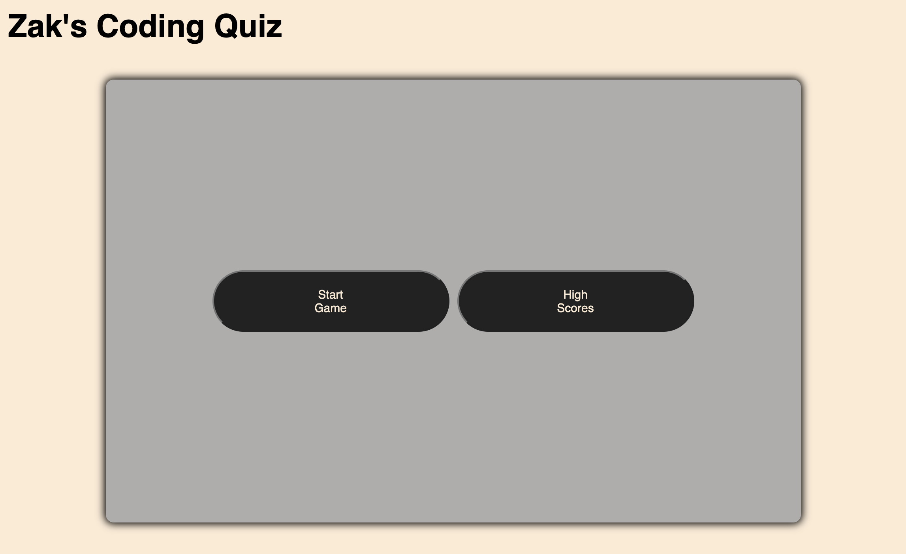

# Zak's Coding Quiz

Discription:
This Challenge is to build a timed coding quiz with multiple-choice questions. This app runs in the browser, and features dynamically updated HTML and CSS powered by JavaScript code. It provides a clean, polished, and responsive user interface that is easy on the eyes and fun to play.

 

- started with by building a basic HTML page including 
- Added h1, container div including the 4 basic buttons to be used as answer choices 
- added a controls div including the 2 starter page buttons "Start Game" and "High Scores 
- built the css out to use 2 main colors with 
- added CSS styles for hovering 
- added classes to divs in HTML to be used for hiding and showing the items when needed.  
- started the JS file with the click listener on the "Starg Game"  and "High Score"buttons 
- added timer to auto start once game has begun 
- used Javascript to hide classes to the "Starg Game"  and "High Score"buttons 
- Added 7 questions as arrays to be called randomly throughout game 

 

- Git Repo - https://github.com/theoneandonlyzako/zaks_coding-quiz 
- Direct link - https://theoneandonlyzako.github.io/zaks_coding-quiz/  

